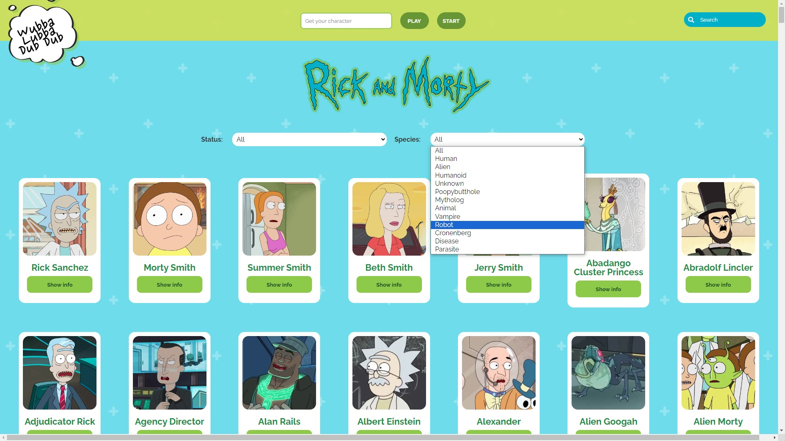

# 

## ¡Bienvenidas a la aventura interdimensional de la página de personajes de Rick y Morty!

¿Eres una verdadera fanática de la serie? ¿Has soñado con explorar todos los rincones del multiverso junto a Rick y Morty? ¡Pues estás de suerte! Nuestra página ha sido creada pensando en ti, la apasionada seguidora de las locuras científicas y desventuras cósmicas.

¿Te has preguntado alguna vez cuál sería tu compañero interdimensional perfecto? ¡Ahora puedes averiguarlo! Simplemente ingresa tu nombre y haz clic en el botón misterioso. Nuestro algoritmo intergaláctico seleccionará un personaje aleatorio de la serie para acompañarte en esta emocionante travesía. ¿Será un Meeseeks? ¿Un alienígena extravagante? ¿O tal vez incluso un Morty del universo paralelo? ¡La emoción está garantizada!

Pero eso no es todo. Si deseas explorar más allá, tenemos una vasta colección de tarjetas de personajes esperando a ser descubiertas. Utiliza los filtros de especie y estado para encontrar a tus personajes favoritos o a aquellos en situaciones cósmicas un tanto inciertas. ¿Eres una seguidora de los humanos, los aliens o tal vez algo más inusual? ¡Tú decides!

¿Buscas a ese personaje escurridizo que solo apareció una vez en un capítulo? No te preocupes, nuestra barra de búsqueda te ayudará a encontrarlo en un abrir y cerrar de portales. ¡La diversión de explorar el multiverso ahora está en tus manos!

Así que, fanática intrépida, prepárate para sumergirte en un océano de datos, aventuras y personajes estrafalarios. Nuestra página te ofrece la herramienta definitiva para saciar tu curiosidad y explorar todos los recovecos de la serie.  
[Haz clic](https://ivonneconde.github.io/DEV010-data-lovers/src/)  
[Haz clic](https://cyncaro.github.io/DEV010-data-lovers/src/)  
¡Descubre y diviértete en el maravilloso mundo de Rick y Morty como nunca antes!

***

## 1. Proceso creativo y desarrollo.

Para esta divertida aventura, iniciamos con un prototipo a lápiz (pluma) y papel, sobre cómo nos imaginamos que, nosotras como fans de la serie, nos gustaría buscar y encontrar la información.

Después, pasamos a hacerlo un poco más real.

Como verás, al principio buscamos que nuestra página tuviera un inicio, pero para qué retrasar la diversión si podemos llegar de una sola vez. 😉🌠

¿Pero cómo pusimos manos a la obra?
Nos organizamos usando la gran plataforma de Trello para descargar las tareas que debíamos hacer, según cada Historia de usuario.

En nuestra investigación:
La serie de Rick & Morty tiene 6 temporadas y puede llegar a ser complicada ya que hay muchísimos personajes, entre ellos hay clones, aliens, robots, etc. 
Nuestra página ayudaría al usuario (fan) a conocer un poco más sobre los personajes, y como son demasiados, hay un filtrado por nombre, o por categorías. Si sólo sabe el nombre, de la misma forma puede buscarlo por nombre.
Además, si el usuario desea conocer un poco más de la serie y personajes que no conoce, esta página le da un breve juego de interacción en el que le dará un personaje cuando escriba su nombre, el resultado podría ser cualquiera.

Probamos nuestra página con algunas personas, y nos dieron algunas sugerencias sobre la interfaz, por lo tanto hicimos algunos ajustes 🔩.

Y ahora, es así como se ve la página al final:

Esperamos que te ayude a entender mejor la serie y, ¡qué te diviertas!

### 2. Aspectos Técnicos

Probamos varios escenarios con nuestras funciones para encontrar errores.

### 3. Problemas de Usabilidad (Resueltos)

* [ ] Considerábamos una página de inicio y nos sugirieron descartarlo.
* [ ] Se nos sugirío poner el logo de la serie para dar contexto.
* [ ] Nos sugirieon una herramienta para mejorar la visualización como los contrastes de color.
* [ ] El background tuvo una mejora.
* [ ] Descartamos filtrar los personajes por género, ya que nos pareció irrelevante.
* [ ] Implementamos una tipografía diferente para su legibilidad.
* [ ] Un diseño responsivo a nuestro buscador.
* [ ] Buscamos que fuera más interactivo el cálculo para que el usuario conociera más personajes.

##### Este proyecto fue creado por las desarrolladoras:
[Ivonne Conde](https://github.com/IvonneConde),
[Cynthia C. Mtz.](https://github.com/CynCaro)
en proceso con [Laboratoria](https://github.com/Laboratoria)